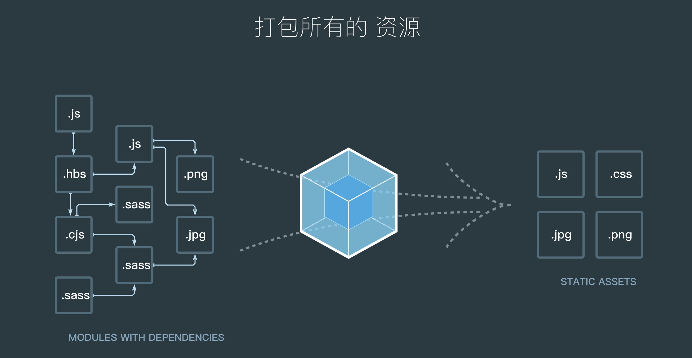

# webpack介绍

webpack通常被大家成为一个打包机，从入口开始做各种分析目录结构，依赖关系，然后通过loader、plugins打包出一些可以被浏览器是被出来的资源。如下图所示

## wepack可以做一下的事情

> 代码转换、文件优化、代码分割、模块合并、自动刷新、代码校验、资源模块打包

## 本笔记会记下学习以下的要点

- [webpack常见配置](./note3/note.md)
- [webpack高级配置](./note4/note.md)
- [webpack优化方式](./note5/note.md)
- ast抽象语法树的学习
- [介绍webpack中的tapatale](./note6/note.md)
- [编写webpack常见的loader](./note7/note.md)
- [编写webpack的plugin](./note8/note.md)